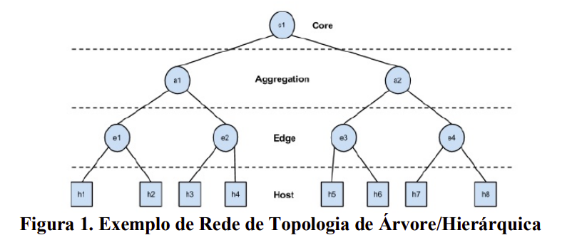

# Topologia em Árvore
Esse projeto é o segundo e ultimo trabalho da matéria Redes de Computadores da UNB. O objetivo é a criação de uma topologia em árvore, e aplicação de um algorítmo de roteamento na rede.

## Especificações
A figura a seguir representa a topologia a ser criada.

A rede deve seguir as seguintes regras:
- A rede é um domínio autônomo, com uma única classe de rede.
- As subredes **e1** e **e2** devem ter capacidade para endereçar ao menos 90 hosts em cada uma.
- As subredes **e3** e **e4** devem ter capacidade para endereçar ao menos 33 hosts em cada uma
- Os roteadores de agregação em **a1** e **a2** devem ser capazes de suportar ao menos 8 subredes cada um.

## Tarefas

- [ ] Criar a topologia com as especificações corretas
- [ ] Encontrar e implementar algoritmo de roteamento