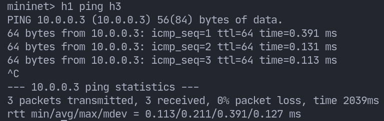

# Topologia em Árvore

Esse projeto é o segundo e ultimo trabalho da matéria Redes de Computadores da UNB. O objetivo é a criação de uma topologia em árvore, e aplicação de um algorítmo de roteamento na rede.

## Como usar

Para o usar o projeto você deve:
1. Instalar o mininet. Segue o link para o [download](http://mininet.org/download/).
2. Clonar o repositório `git clone https://github.com/dapeduu/tree-topology.git`
3. Rodar o controller remoto pox: `sudo ~/pox/pox.py forwarding.l2_pairs info.packet_dump samples.pretty_log log.level --DEBUG`
4. Rodar o projeto `python ./src/main.py`

Os passos acima vão te deixar na CLI do mininet.

Para testar se está tudo funcionando tente dar o ping entre um host e outro: `h1 ping h3`

## Especificações

A figura a seguir representa a topologia a ser criada.

A rede deve seguir as seguintes regras:
- A rede é um domínio autônomo, com uma única classe de rede.
- As subredes **e1** e **e2** devem ter capacidade para endereçar ao menos 90 hosts em cada uma.
- As subredes **e3** e **e4** devem ter capacidade para endereçar ao menos 33 hosts em cada uma
- Os roteadores de agregação em **a1** e **a2** devem ser capazes de suportar ao menos 8 subredes cada um.

## Tarefas

- [ ] Criar a topologia com as especificações corretas
- [ ] Encontrar e implementar algoritmo de roteamento